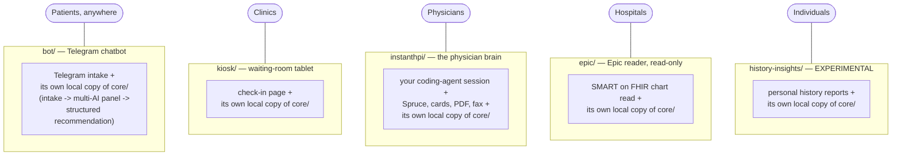
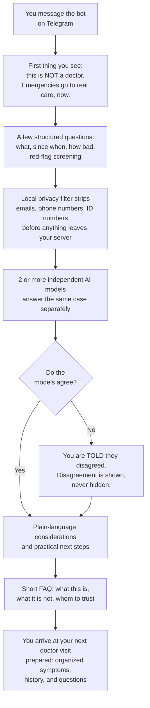
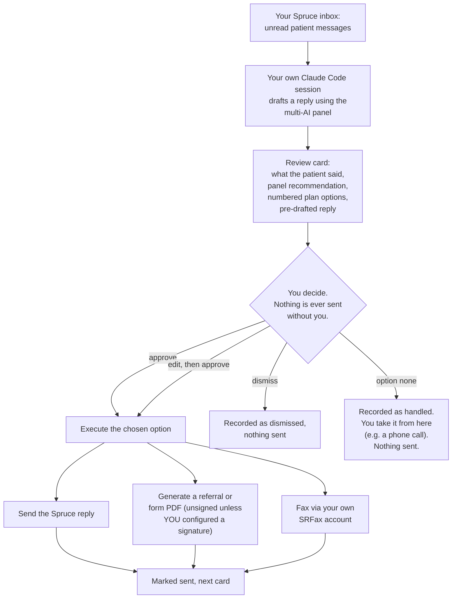
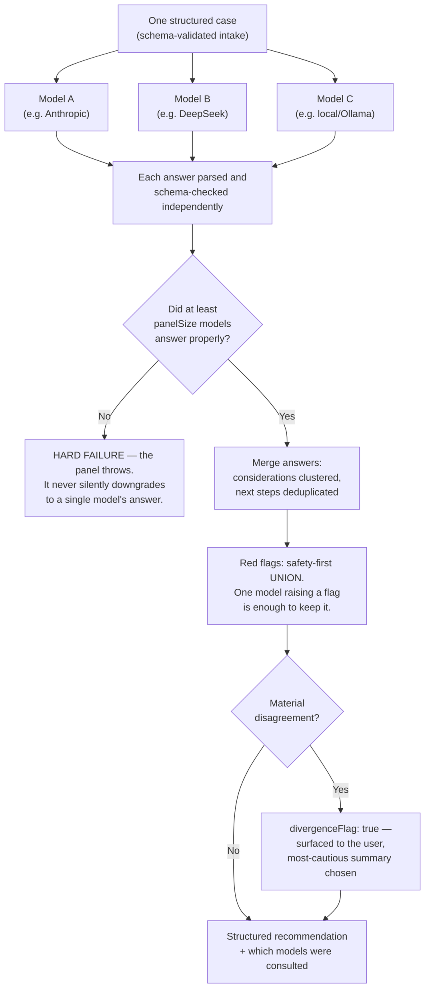
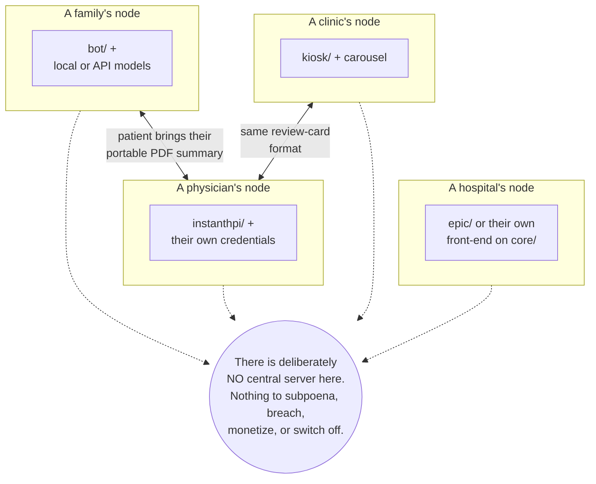

# Diagrams — how FreeEducationHealth works, drawn

Five diagrams, from the widest view to the most specific. They render
directly on GitHub (Mermaid). Everything here matches the code as shipped;
where something is a stated future direction rather than built software,
the diagram says so explicitly.

---

## 1. Which piece is for me? — each person installs ONLY what they need

This project is one system only to the people who built it. To everyone
else it is five separate tools: **you pick the one row below that describes
you, install only that piece, and follow only that piece's instructions**
— each folder ships with its own complete setup guide, and each is
available as its own standalone download.

There is **no engine service and nothing shared at runtime**. `core/` is a
code *library* — the intake/panel/recommendation logic — and every
deployment carries its **own copy inside itself**, called as a local
function on the self-hoster's own machine. What the five front-ends share
is source code, the way two clinics might use the same textbook: same
content, separate books.

Every self-hoster runs their own copy with their own credentials. There is
no shared server and no shared engine, so there is no central place where
anyone's health information accumulates — and nothing that can be switched
off for everyone at once.

---

## 2. A patient's journey through the bot (for the public)

The goal of every session is the last box: **prepare for a doctor visit**,
even where that visit may be far away — not to replace it.

---

## 3. A physician's daily loop (instanthpi/)

The AI drafts; **the physician remains the author of record** — the same
relationship as with a scribe or dictation service.

---

## 4. Inside the multi-AI panel — why a committee, not one model

In a clinic, a physician reviews the AI's output. In a free worldwide
deployment there is no physician behind every session — **the panel's
required consensus is what substitutes for that oversight**, and its
disagreement is always shown rather than resolved by picking a favorite.

---

## 5. The deployment topology — many independent nodes, no center

Each deployment stands alone and keeps working regardless of what happens
to any other — including this repository's original host: the code is
permissively licensed and downloadable as self-contained archives
(`package-releases.cjs`), so any node can seed new ones. Local physicians
can work with nearby self-hosted nodes using the same card formats and
portable summaries. (The longer-term vision of coordinated networks of
such nodes is recorded in `docs/design-decisions.md` as a future direction
— what is drawn above is what ships today.)
